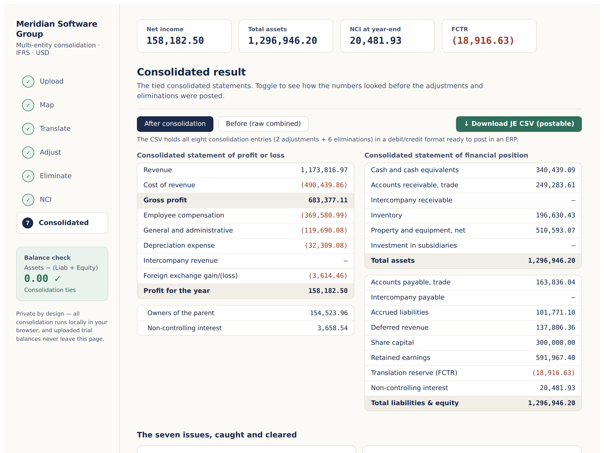

# Multi-Entity Consolidation Dashboard

An interactive, in-browser consolidation engine for a four-entity software group
reporting under **IFRS** in **USD**. It takes four trial balances in four
currencies and produces a tied set of consolidated statements — reproducing the
accompanying Excel workbook to the penny.

**Live demo:** https://consolidation-dashboard-red.vercel.app/



## What it demonstrates

Multi-entity, multi-currency consolidation is where several accounting
competencies meet at once. This tool works through the full close sequence and
makes each step inspectable:

1. **Upload** — a trial balance per entity (sample data pre-loaded; upload to replace)
2. **Map** — each entity's local accounts to the group chart of accounts
3. **Translate** — IAS 21: closing rate for assets/liabilities, average for income/expenses, historical for equity; the translation reserve (FCTR) falls out as the balancing figure
4. **Adjust** — goods-in-transit cut-off, and an intercompany FX true-up
5. **Eliminate** — intercompany revenue, intercompany balances, unrealized profit in inventory, and investment vs equity
6. **NCI** — carve out the 20% non-controlling interest, including its share of the translation reserve
7. **Consolidated** — tied P&L and balance sheet, with a before/after view and a postable journal-entry export

A running **balance check** (Assets − (Liabilities + Equity)) is visible on every
step and turns green only when the consolidation ties.

## Seven consolidation issues, modelled and resolved

The trial balances contain seven deliberately planted issues, each mapped to a
competency and cleared through the flow:

| # | Issue | Resolved by |
|---|-------|-------------|
| 1 | Intercompany balance mismatch (FX-driven) | Retranslate the monetary balance at closing; FX loss to P&L; then eliminate |
| 2 | Unrealized profit in inventory | Eliminate intra-group markup on unsold stock |
| 3 | Wrong FX rate on a balance-sheet line | Apply the closing rate in translation (no journal entry) |
| 4 | Translation reserve must balance | Post FCTR as the balancing figure |
| 5 | Cut-off / goods in transit | Book the in-transit adjustment, then eliminate |
| 6 | Mismatched charts of accounts | Map every local account to the group chart |
| 7 | Missing intercompany elimination | Eliminate IC revenue against the matching expense |

## About this project

This is a **built-to-demonstrate** model, not production software. The trial
balances and the seven issues are authored so that each consolidation concept is
visible and checkable, and the figures reconcile to an accompanying Excel workbook.
The translation, account mapping, and tie-out logic are general; the seven scenarios
are specific to the sample dataset. It runs entirely in the browser.

## Privacy

No backend, no external calls. Uploaded trial balances are processed locally and
never leave the page.

## Run locally

```bash
npm install
npm run dev
```

## Build

```bash
npm run build      # outputs static files to dist/
```

Deploy the `dist/` folder to any static host (Vercel, Netlify, GitHub Pages). Or
open `meridian-dashboard-standalone.html` directly in a browser — it needs no build
step.

## Tech

React + Vite. The consolidation engine is plain JavaScript, verified against the
Excel workbook (net income 158,182.50; total assets 1,296,946.21; NCI 20,481.93;
balance check 0).

---

Vaanmathi, CA, CPA
